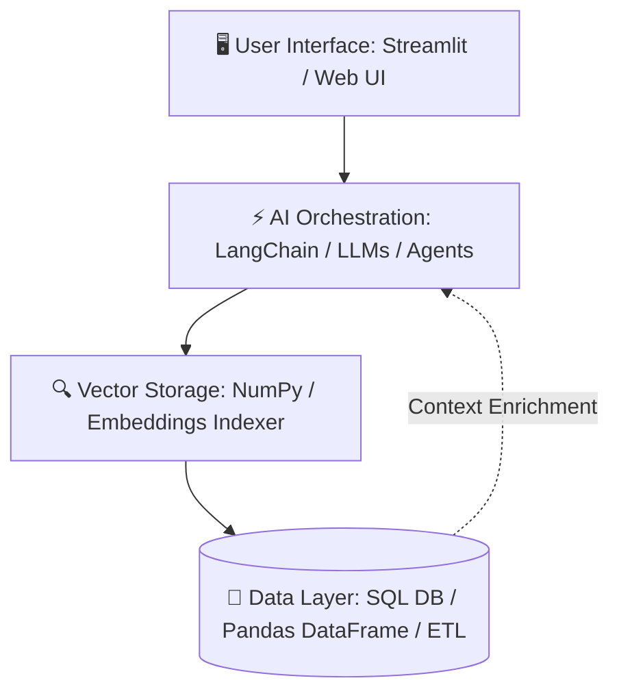

<div align="center">

  <!-- DYNAMIC HEADER BANNER -->
  

  <!-- TYPING SVG SUBTITLE -->
  <a href="https://github.com/marutigore">
    
  </a>

  <br/>

  <!-- CONNECT WITH ME BADGES -->
  <a href="https://linkedin.com/in/maruti-gore" target="_blank">
    
  </a>
  <a href="mailto:maruti6750@gmail.com">
    
  </a>
  <a href="https://github.com/marutigore" target="_blank">
    
  </a>

  <br/><br/>

  <!-- STATUS BADGES -->
  
  
  
  

</div>

---

### 💫 About Me

```yaml
Name: Maruti Gore
Role: AI & ML Engineer | Data Analyst Intern | Python Backend Developer
Mission: Engineering high-performance AI systems, scalable RAG pipelines, and automated intelligence tools.
Core Passions:
  - 🤖 Generative AI & Large Language Models (Gemini, DeepSeek, Llama 3.1)
  - ⚡ Retrieval-Augmented Generation (RAG) & Semantic Vector Search
  - 📊 Data Analytics, ETL Pipelines & Interactive Dashboards
  - 🛠️ Scalable Backend APIs & Containerized Deployments
```

---

### ⚡ Technology Stack

<div align="center">
  
</div>

<br/>

| Domain | Technologies & Frameworks |
| :--- | :--- |
| **🧠 Artificial Intelligence** | Machine Learning, Deep Learning, NLP, Scikit-Learn |
| **✨ Generative AI & LLMs** | LangChain, Llama 3.1, Gemini API, DeepSeek AI, Ollama, Prompt Engineering |
| **⚡ RAG & Vector Search** | Cosine Similarity Vector Indexing, In-memory Retrievers, Semantic Search |
| **📊 Data Engineering** | Pandas, NumPy, SQL, ETL Pipelines, Data Quality Assurance, Web Scraping |
| **🌐 Backend & UI** | Streamlit, FastAPI, Flask, Next.js, Supabase |
| **☁️ DevOps & Tools** | Docker, Git, Linux, Jupyter, Google Colab, VS Code |

---

### 🏗️ Engineering Architecture



---

### 🚀 Featured Projects

<table width="100%">
  <tr>
    <td width="50%" valign="top">
      <h3>🌟 <a href="https://github.com/marutigore/Synthara">Synthara</a></h3>
      <p>AI-powered data preparation platform that converts natural language prompts into structured datasets using automated web scraping and LLMs.</p>
      <p><b>Tech:</b> <code>Python</code> • <code>Gemini API</code> • <code>DeepSeek AI</code> • <code>Next.js</code> • <code>Supabase</code></p>
      <a href="https://github.com/marutigore/Synthara"></a>
    </td>
    <td width="50%" valign="top">
      <h3>🤖 <a href="https://github.com/marutigore/AI_DATA_ANALYST_CHATBOT1">AI Data Analyst Chatbot</a></h3>
      <p>Streamlit web application utilizing <b>Retrieval-Augmented Generation (RAG)</b> for semantic document Q&A and automated data science analytics.</p>
      <p><b>Tech:</b> <code>Python</code> • <code>Streamlit</code> • <code>LangChain</code> • <code>Vector Indexing</code> • <code>Scikit-Learn</code></p>
      <a href="https://github.com/marutigore/AI_DATA_ANALYST_CHATBOT1"></a>
    </td>
  </tr>
  <tr>
    <td width="50%" valign="top">
      <h3>📜 <a href="https://github.com/marutigore/RAG-Based-Company-Policy-Chatbot">RAG Company Policy Chatbot</a></h3>
      <p>Intelligent HR and enterprise document assistant leveraging vector search embeddings to deliver precise policy answers from internal knowledge bases.</p>
      <p><b>Tech:</b> <code>Python</code> • <code>LangChain</code> • <code>Vector Search</code> • <code>Streamlit</code></p>
      <a href="https://github.com/marutigore/RAG-Based-Company-Policy-Chatbot"></a>
    </td>
    <td width="50%" valign="top">
      <h3>🐳 <a href="https://github.com/marutigore/docker-counter-app">Dockerized Counter Application</a></h3>
      <p>Production-ready containerized microservice demonstrating multi-container deployment, health check orchestration, and state persistence.</p>
      <p><b>Tech:</b> <code>Python</code> • <code>Docker</code> • <code>Docker Compose</code> • <code>Backend API</code></p>
      <a href="https://github.com/marutigore/docker-counter-app"></a>
    </td>
  </tr>
</table>

---

### 🔥 GitHub Activity & Stats

<div align="center">
  
  
</div>

<br/>

<div align="center">
  <a target="_blank" rel="noopener noreferrer nofollow" href="https://github-readme-activity-graph.vercel.app/graph?username=marutigore&theme=github-dark&hide_border=true&radius=16">
    
  </a>
</div>

---

### 🌱 What I'm Exploring & Building
- 🤖 **Agentic AI:** Autonomous multi-agent workflows and tool-calling architectures.
- ⚡ **Advanced RAG:** Hierarchical chunking, re-ranking, and hybrid dense/sparse vector retrieval.
- 🚀 **MLOps:** CI/CD pipeline automation for AI models and containerized cloud services.
- 📈 **High-Scale Data Pipelines:** Distributed ETL workflows and real-time streaming analytics.

---

<div align="center">
  <h3>📫 Let's Connect & Collaborate!</h3>
  
  <a href="https://linkedin.com/in/maruti-gore" target="_blank">
    
  </a>
  <a href="mailto:maruti6750@gmail.com">
    
  </a>
  <a href="https://github.com/marutigore" target="_blank">
    
  </a>

  <br/><br/>
  <sub>💡 <i>"Transforming Ideas Into Intelligent Systems Through AI & Engineering"</i> • Built with ❤️ by <b>Maruti Gore</b></sub>
</div>
